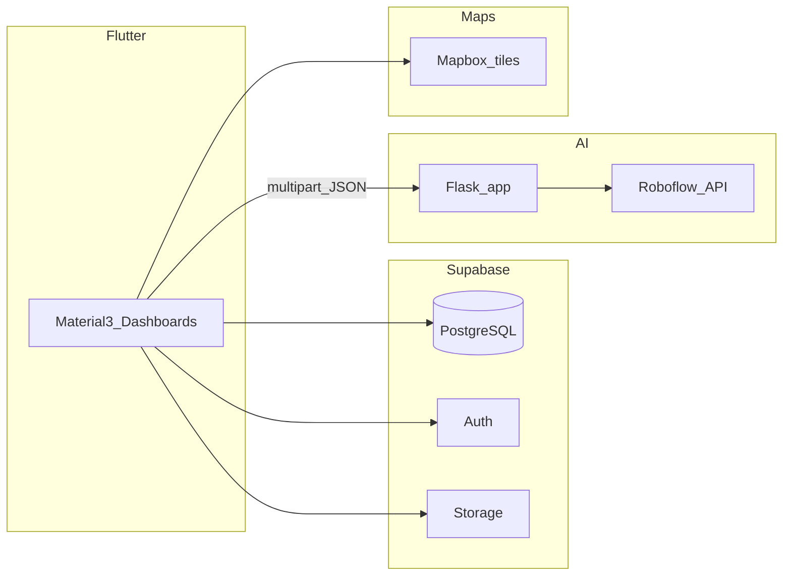

# Road Nirman(This is our final work)

**Road Nirman** is an end-to-end **smart road damage reporting and response system** aimed at municipal operations (demo context: **Solapur Municipal Corporation**). Citizens report damage with photos and location; a **Flask** service runs **Roboflow** pothole detection and computes **severity** and **EPDO-style** risk scores; **Supabase** stores complaints, auth, images, and audit events; **Flutter** delivers role-based dashboards from junior engineer through commissioner, plus contractors and verification (including **SSIM** repair checks).

**Repository:** [github.com/rajiv-golait/road-nirmaan](https://github.com/rajiv-golait/road-nirmaan)

---

## Why this exists

Traditional complaint systems are often **reactive** and **disconnected** from evidence and prioritization. Road Nirman ties **geo-tagged multimedia**, **AI-assisted assessment**, **duplicate detection** near existing open cases, **SLA-aware escalation** (JE → AE → DE → CE), and **traceable workflows** so field staff see the same scores and history that the system stores.

---

## What you get

| Capability | Details |
|------------|---------|
| Citizen reporting | Web/mobile flows: photos, GPS or photo EXIF where available, category, duplicate check before create |
| AI analysis | Multipart upload to Flask `/detect-flutter` → Roboflow → severity / EPDO / priority; optional offline estimate if the server is unreachable |
| Spatial dedup | Nearby open complaints within a radius (Flask `/check-duplicate` + Haversine) |
| Operations | Ward-aware lists, maps (Mapbox tiles), SLA indicators, assignments, contractor and CE verification paths |
| Repair proof | Before/after images and SSIM via `/verify-repair` |
| Governance | `complaint_events` and RLS-oriented schema for audit-friendly storage |

---

## Architecture



- **State:** `ComplaintStore` (singleton `ChangeNotifier`) coordinates UI; **`ComplaintService`** persists to Supabase and updates the store.
- **Timers:** `main.dart` runs auto-escalation on an interval and on resume (see `lib/utils/escalation_config.dart`).
- **Deeper file map:** [`CLAUDE.md`](CLAUDE.md).

---

## Repository layout

| Path | Role |
|------|------|
| [`lib/`](lib/) | Flutter app: screens, services (`complaint_store.dart`, `complaint_service.dart`, `flask_ai_service.dart`, …), widgets |
| [`AI Integration/`](AI%20Integration/) | Flask: `app.py` — `/detect-flutter`, `/check-duplicate`, `/verify-repair`, `/health` |
| [`supabase/`](supabase/) | `schema.sql`, `rls.sql`, `migrate.sql`, `seed.sql`, `demo_accounts.sql`, optional `storage.sql` |
| [`docs/`](docs/) | [`DEMO_WORKFLOWS.md`](docs/DEMO_WORKFLOWS.md), [`FINAL_SUBMISSION_SAMVED_2026.md`](docs/FINAL_SUBMISSION_SAMVED_2026.md) |
| [`assets/`](assets/) | Static assets |
| [`.env.example`](.env.example) | Copy to `.env` (not committed) |

---

## Prerequisites

| Requirement | Notes |
|-------------|--------|
| Flutter | SDK compatible with `pubspec.yaml` (e.g. ^3.10) |
| Dart | Ships with Flutter |
| Python | 3.9+ for Flask; using **`uv`** + a project venv is recommended (see below) |
| Supabase project | For Postgres, Auth, Storage |
| Mapbox token | Public token for tiles / related features (`--dart-define=MAPBOX_TOKEN=...`) |
| Roboflow | API key in root `.env` for Flask (required to start `app.py`) |

---

## Quick start

### 1. Clone and install Flutter deps

```bash
git clone https://github.com/rajiv-golait/road-nirmaan.git
cd road-nirmaan
flutter pub get
```

### 2. Environment files

```bash
cp .env.example .env
```

Edit **project root** `.env` (Flask loads it from the parent of `AI Integration/`):

- `MAPBOX_ACCESS_TOKEN` — geocoding / map context in Flask
- `ROBOFLOW_API_KEY` — **required** for inference
- Optional: `ROBOFLOW_MODEL_ID`, `ROBOFLOW_API_URL`

Configure the Flutter app with your **Supabase URL** and **anon key** in [`lib/main.dart`](lib/main.dart) (or refactor to `--dart-define` / a small config module if you prefer not to hardcode).

### 3. Supabase SQL (order matters)

In **Supabase → SQL Editor**, run in order:

1. `supabase/schema.sql`
2. `supabase/rls.sql`
3. `supabase/storage.sql` (if you use Storage buckets from this repo)
4. `supabase/migrate.sql`
5. `supabase/seed.sql` (optional demo data)
6. `supabase/demo_accounts.sql` (optional; after creating matching Auth users)

### 4. Flask backend (recommended: `uv`)

```bash
cd "AI Integration"
uv venv .venv
uv pip install -r requirements.txt --python .venv/Scripts/python.exe
# Linux/macOS: --python .venv/bin/python
.venv/Scripts/python.exe app.py
```

Server listens on **`0.0.0.0:5000`**. Check **`GET http://127.0.0.1:5000/health`**.

### 5. Run the Flutter app

**Android emulator** (Flask on host):

```bash
flutter run --dart-define=MAPBOX_TOKEN=YOUR_PK_TOKEN
# Default FLASK_URL in code targets 10.0.2.2:5000 for emulator
```

**Web / Chrome** (Flask on same machine):

```bash
flutter run -d chrome --dart-define=MAPBOX_TOKEN=YOUR_PK_TOKEN --dart-define=FLASK_URL=http://localhost:5000
```

**Physical device** on the same LAN as your PC:

```bash
flutter run --dart-define=MAPBOX_TOKEN=YOUR_PK_TOKEN --dart-define=FLASK_URL=http://YOUR_PC_LAN_IP:5000
```

Allow **inbound TCP 5000** on Windows Firewall for LAN testing.

### 6. Quality checks

```bash
flutter analyze
flutter test
```

---

## Environment and flags

### Root `.env` (Python / Flask)

| Variable | Required | Purpose |
|----------|----------|---------|
| `ROBOFLOW_API_KEY` | Yes | Roboflow serverless inference |
| `MAPBOX_ACCESS_TOKEN` | Strongly recommended | Location context in scoring pipeline |
| `ROBOFLOW_MODEL_ID` | No | Default model id in `app.py` / env |
| `ROBOFLOW_API_URL` | No | Default serverless base URL |

### Flutter `--dart-define`

| Flag | Role |
|------|------|
| `MAPBOX_TOKEN` | Map tiles / map-related config |
| `FLASK_URL` | Base URL for AI HTTP client ([`lib/utils/constants.dart`](lib/utils/constants.dart)) |
| `ALLOW_MOCK_DATA` | When `true`, enables mock/seeder paths for development |
| `ALLOW_DEMO_LOGIN` | Demo login path in `demo_role_router` (keep `false` for real demos) |

---

## Flask API (AI Integration)

| Endpoint | Method | Description |
|----------|--------|-------------|
| `/health` | GET | Health and key presence |
| `/detect-flutter` | POST | Multipart `images`, optional lat/lng → severity, EPDO, detections, recommendations |
| `/check-duplicate` | POST | JSON body: coordinates + nearby complaint list → duplicate suggestion |
| `/verify-repair` | POST | Before/after images → SSIM and verdict |

---

## Documentation

| Document | Contents |
|----------|----------|
| [`CLAUDE.md`](CLAUDE.md) | Maintainer-oriented architecture and command cheat sheet |
| [`docs/DEMO_WORKFLOWS.md`](docs/DEMO_WORKFLOWS.md) | Step-by-step demo scripts for judges or reviewers |
| [`docs/FINAL_SUBMISSION_SAMVED_2026.md`](docs/FINAL_SUBMISSION_SAMVED_2026.md) | Problem alignment, subsystem checklist, scope notes (academic / SAMVED-style) |

---

## Demo and review checklist

- Set `ALLOW_MOCK_DATA=false` and `ALLOW_DEMO_LOGIN=false` for a realistic Supabase-backed demo.
- Run Flask with valid **Roboflow** (and ideally **Mapbox**) keys; confirm new complaints show `ai_source`, `severity_score`, `epdo_score` in the database when the AI path succeeds.
- Follow **`docs/DEMO_WORKFLOWS.md`** for role-by-role flows.

---

## Troubleshooting

| Symptom | What to verify |
|---------|----------------|
| Blank map | `MAPBOX_TOKEN` passed to `flutter run`; check console for missing defines |
| AI always falls back | `FLASK_URL` reachable from device (LAN IP, not `localhost`, on a real phone); Flask bound to `0.0.0.0`; firewall |
| Flask refuses to start | `ROBOFLOW_API_KEY` in **repo root** `.env`; restart after edits |
| Supabase insert / RLS errors | `migrate.sql` applied; user logged in; policies match your schema |
| `ModuleNotFoundError: flask` | Use a venv and `pip install -r requirements.txt`, or `uv` as in Quick start |

---

## Contributing

1. Branch from `main`.
2. Run `flutter analyze` before opening a PR.
3. Do not commit `.env`, API keys, or keystores.

---

## License and acknowledgments

Developed for **Solapur Municipal Corporation** / academic and demonstration use. Add an explicit SPDX license file if you publish broadly.

**Stack credits:** Flutter, Supabase, Mapbox, Roboflow, and the open-source packages listed in `pubspec.yaml` and `AI Integration/requirements.txt`.

---

## Maintainer note

For file-level relationships (escalation timer, AI pipeline, dashboard adapters), keep **`CLAUDE.md`** alongside this README.
